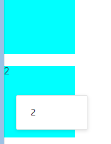

# vue-context-menu

## 安装

```
npm install @xxllxx/vue-context-menu
或
yarn add @xxllxx/vue-context-menu

```

## 使用

### 全局注册

```javascript
// src/main.js
import Vue from 'vue'
//...
import context from '@xxllxx/vue-context-menu'
// 全局注册
Vue.use(context)
// 重命名组件名称 默认 context-menu 和 context-menu-item
// Vue.use(context, { name: 'contextMenu', itemName: 'contextMenuItem' })

//...
//...
```

### context-menu 属性方法

|  参数  |              说明              |  类型  |        可选值         |   默认值    |
| :----: | :----------------------------: | :----: | :-------------------: | :---------: |
|  mode  |            触发方式            | String | click/contextmenu/all | contextmenu |
| width  |            菜单宽度            | String |           —           |   自适应    |
| offset | 固定菜单位置，根据父级的偏移量 | Object |     {x:120,y:20}      |    null     |

### context-menu-item 属性

|  参数  |   说明   |   类型   | 可选值 | 默认值 |
| :----: | :------: | :------: | :----: | :----: |
| lable  | 显示文字 |    ——    |   ——   |
| @click | 触发事件 | Function |   ——   |   ——   |

### 使用

> 直接添加到需要右键菜单的元素下

```javascript
// src/view/home.vue
<template>
  <div>
    <div class="homeItem">
      1
      <context-menu width="120px">
        <context-menu-item @click="item2">
      	  <!-- 自定义摸版 -->
          
          标签
        </context-menu-item>
        <context-menu-item @click="item2">
          
          钱包
        </context-menu-item >
        <context-menu-item @click="item1">
          
          包裹
        </context-menu-item >
        <context-menu-item @click="item1">
          
          物流
        </context-menu-item>
      </context-menu >
    </div>
    <div class="homeItem">
      2
      <context-menu width="120px">
        <context-menu-item @click="item2">2</context-menu-item>
      </context-menu>
    </div>
  </div>
</template>

<script>
export default {
  name: 'home',
  methods: {
    item1() {
      alert(1)
    },
    item2() {
      alert(2)
    },
    item3() {
      alert(3)
    }
  }
}
</script>
<style scoped>
.homeItem {
  background: aqua;
  width: 120px;
  margin-top: 20px;
  height: 120px;
}
.menu-item img {
  margin-top: -1px;
}
</style>
```

## 效果



